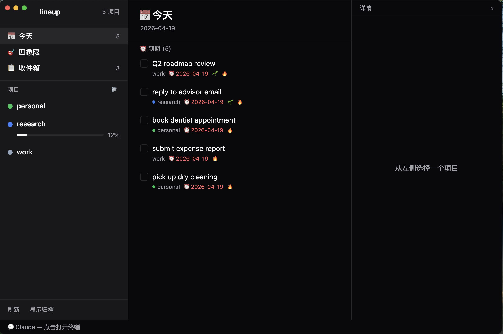
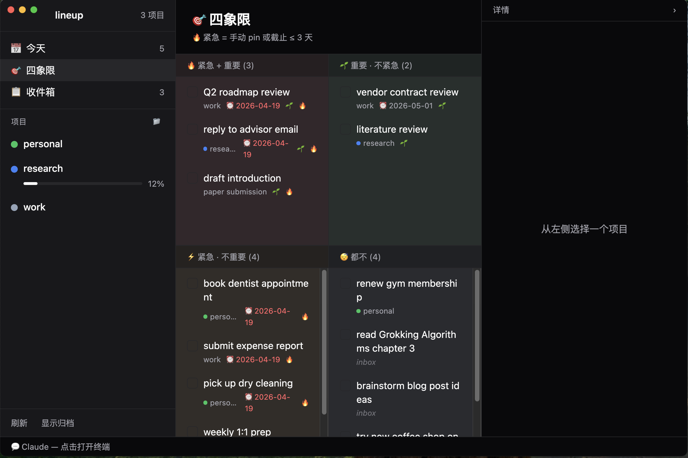
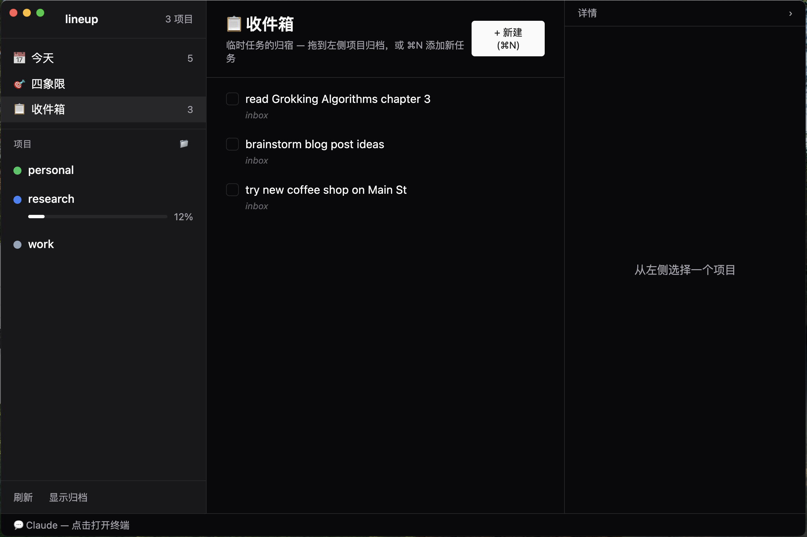
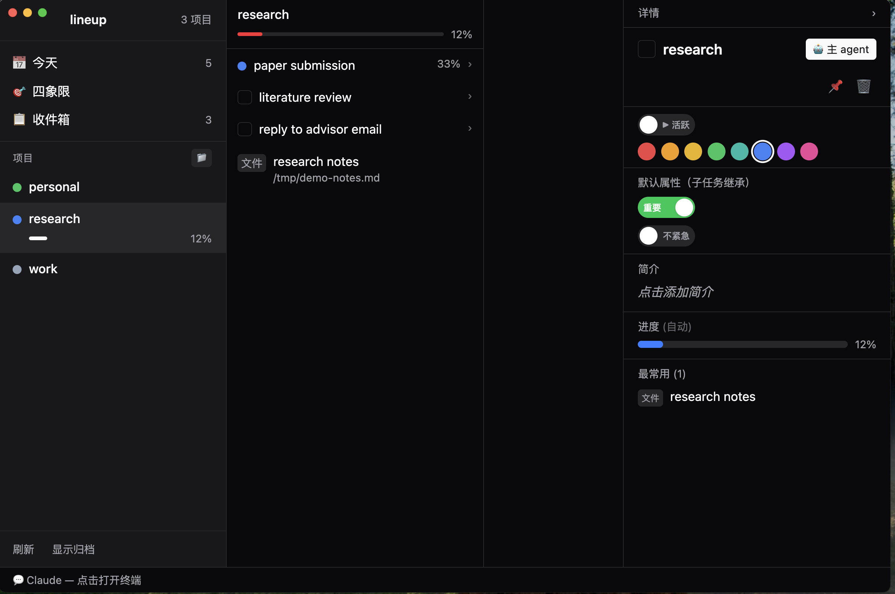
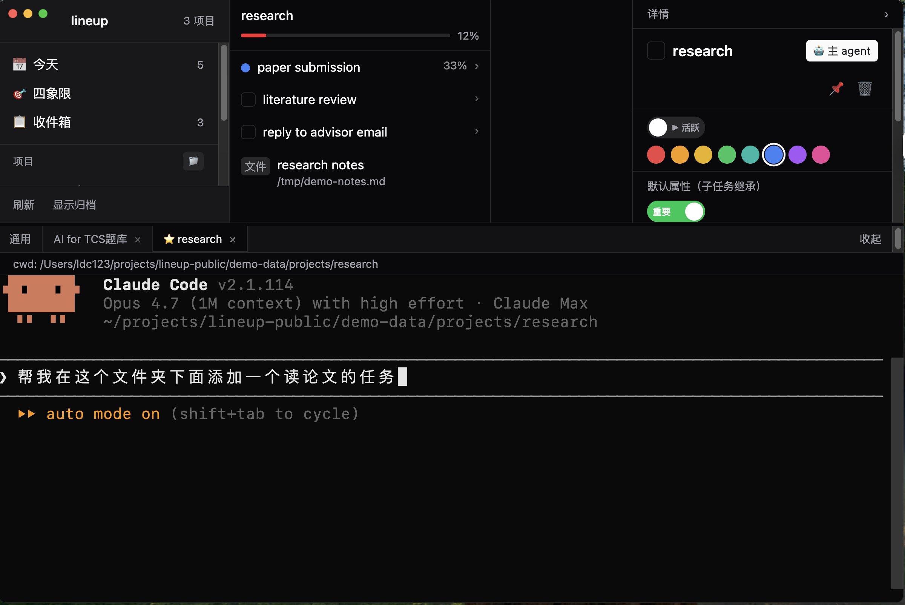

# lineup

A project management desktop app with Miller-column navigation, task/step hierarchy, and AI agent integration.

Built with Electron + React + TypeScript + Tailwind CSS + better-sqlite3.

## Screenshots

**Today view** — active tasks due today, grouped with parent project + color + priority.



**Eisenhower matrix** — four quadrants by importance × urgency. Tasks auto-flagged urgent when due ≤ 3 days.



**Inbox** — orphan tasks from Quick-Add (⌘N) live here until you drag them into a project.



**Project detail + Inspector** — sub-projects, tasks, linked files/URLs, progress, color, pin-to-sidebar, main agent launcher.



**Embedded Claude agent** — per-project terminal running Claude Code with auto-generated CLAUDE.md and MCP tools for structured task management.



## Features

**Project management**
- Miller-column (Finder-style) navigation for projects, tasks, and files
- Three-level hierarchy: **project** → **task** → **step** (sequential checklist)
- Drag-and-drop: move/copy objects between projects, reference projects in multiple locations
- Eisenhower matrix (important × urgent) with auto-urgent from due dates
- Recurring tasks with auto-reset
- Today / Eisenhower / Inbox filtered views
- Pin projects to the sidebar, color-code, track progress per sub-project

**File integration**
- Preview files inline: Markdown (with LaTeX math), PDF, images, DOCX, XLSX, HTML
- Preview URLs via embedded browser (with persistent cookies)
- Full-text search across linked objects (⌘F)

**Information sources** *(opt-in, each activates only if the underlying app is installed)*
- **Apple Mail** — search and link messages from any account Mail.app syncs (iCloud, Gmail, Exchange, IMAP)
- **Obsidian** — browse vaults, link notes
- **Trilium** — browse notes from a Trilium server
- **Zotero** — browse collections, link papers and PDFs
- **Todoist** — one-way sync of Todoist projects into lineup
- See [docs/sources.md](docs/sources.md) for setup, especially the email walkthrough

**Multi-source agent session browser** *(zero setup if you already use any of these tools)*

Most coding agents drop a transcript on disk for every conversation. Lineup walks those directories and surfaces **every session you've ever had with any supported agent**, grouped by working folder and time bucket — read-only, no API keys, nothing to configure.

| Agent | Where lineup reads | Status in lineup |
| --- | --- | --- |
| **Claude Code** | `~/.claude/projects/<encoded-cwd>/<uuid>.jsonl` | view + resume in embedded terminal |
| **openclaw** | same store (openclaw wraps Claude Code) — auto-detected via path | view + resume |
| **Codex** (OpenAI CLI / ChatGPT Codex) | `~/.codex/sessions/YYYY/MM/DD/rollout-*.jsonl` | view-only |
| **Hermes** | `~/.hermes/sessions/*.jsonl` | view-only |

The Agents view shows a colored badge on every row so you can tell at a glance which agent ran which conversation, with a per-source filter chip ("only Codex", "only openclaw", etc.). Inside each session you get the full prompt + response timeline, model used, token / cost breakdown for the agents that record it, and optional MiMo-generated one-line summaries.

This is the fastest way to answer "wait, how did I solve that bug last week", "what has openclaw been spending my Anthropic credits on", or "what was the prompt I tried in Codex yesterday" — without leaving lineup.

Adding another agent is a small reader file in [`frontend/src/main/sessionSources.ts`](frontend/src/main/sessionSources.ts) — see [docs/sessions.md](docs/sessions.md) for the recipe and notes on what it would take to bring resume-in-lineup-terminal support to Codex.

**AI agent system** *(optional, requires [Claude Code CLI](https://docs.anthropic.com/en/docs/claude-code))*
- Embedded terminal (xterm.js + node-pty) running Claude Code per project
- Per-project virtual workspace with auto-generated CLAUDE.md (editable from the inspector drawer)
- Agent dispatch: main agent can orchestrate sub-agents across folders
- MCP integration for structured project/task/step management
- Live memory monitor for diagnosing runaway Electron / pty processes

## Quick start

```bash
git clone https://github.com/billyldc/lineup-public.git
cd lineup-public/frontend
npm install        # ~1 min, rebuilds native modules against Electron
npm run demo       # launches a populated sandbox app — try first
```

`npm run demo` points lineup at `<repo>/demo-data/` (a throwaway sandbox), seeds it with sample projects + tasks + objects, and launches Electron. **Your real `~/.lineup/` is never touched.** Quit with Ctrl+C. Re-run any time; pass `--reset` to wipe and re-seed.

Once you've poked around the demo and want to use lineup for real:

```bash
cd lineup-public/frontend
npm run dev
```

This launches against `~/.lineup/lineup.db`, which is auto-created on first launch (no Python required). If you want to run the app pointed at *any* custom data dir — multiple isolated instances for work vs personal, test environments, etc. — set `LINEUP_DATA_DIR`:

```bash
LINEUP_DATA_DIR=~/my-other-lineup npm run dev
```

### Troubleshooting native modules

Electron uses a different Node ABI than system Node, so `better-sqlite3` and `node-pty` must be rebuilt against Electron's version. The `postinstall` script does this automatically, but if you see `NODE_MODULE_VERSION` errors:

```bash
npx electron-rebuild -f -o better-sqlite3
```

**node-pty requires Python with `distutils`.** On Python 3.12+ (where distutils was removed), you'll need:

```bash
pip3 install setuptools
npx electron-rebuild -f -o node-pty
```

If `node-pty` fails to build, the embedded terminal / chat panel will be disabled but the rest of the app still works.

### Optional: Python backend (for CLI + MCP + agent features)

```bash
curl -LsSf https://astral.sh/uv/install.sh | sh
uv sync
uv run lu init
```

### Optional: Claude Code integration

Install [Claude Code CLI](https://docs.anthropic.com/en/docs/claude-code), then the embedded terminal and per-project agents will activate automatically.

## Architecture

```
lineup/
  frontend/          # Electron + React app
    src/main/        # Main process: SQLite, IPC, pty manager
    src/preload/     # Context bridge
    src/renderer/    # React UI components
  lineup/            # Python backend (optional)
    store.py         # SQLite data layer
    server.py        # MCP server
    cli.py           # CLI commands
    types/           # Object type registry
    plugins/         # Knowledge source plugins
  ~/.lineup/
    lineup.db        # SQLite database (WAL mode)
    projects/        # Virtual project folders for agents
    config.json      # Optional configuration
```

## Configuration

Create `~/.lineup/config.json` to customize paths (all fields optional):

```json
{
  "triliumServerUrl": "http://localhost:37840",
  "zoteroDbPath": "~/Zotero/zotero.sqlite",
  "obsidianVaultRoots": ["~/Documents", "~/Obsidian"]
}
```

See [docs/sources.md](docs/sources.md) for the full source-by-source setup walkthrough — including how to wire up Apple Mail (the most useful source for most users) without touching IMAP / OAuth yourself.

### LLM key (for session summaries + auto-titles)

The basic project-management features (Miller columns, Today / Eisenhower / Inbox views, file linking, embedded Claude Code terminal) need **no API key** — they're all local.

A few features call out to an LLM and need a key:

- **Session summarization** in the Agents view (the "summarize this session" button)
- **MimoGenerate auto-titles** for Claude sessions
- **Time-bucket rollups** (4-hour / daily summaries of agent activity)

Drop a single-line OpenRouter API key at `~/.lineup/openrouter_key`:

```bash
echo "sk-or-..." > ~/.lineup/openrouter_key
chmod 600 ~/.lineup/openrouter_key
```

Or set `OPENROUTER_API_KEY` in your environment. Lineup will use OpenRouter's auto-rotating model fallback list (Sonnet → Opus → Gemini → DeepSeek) so a single key's region/credit issues don't break the feature.

**Advanced** (optional): if you already run a local multi-provider router that exposes a `/chat` endpoint (e.g. one fronting MiMo + Volcano + 智增增 + OpenRouter for cross-provider load balancing), point lineup at it:

```bash
export LLM_ROUTER_URL=http://127.0.0.1:8765
```

Lineup will try the router first and transparently fall back to direct OpenRouter on connection failure, so neither path is a hard dependency.

## Keyboard shortcuts

| Key | Action |
|-----|--------|
| Cmd+N | Quick-add task to Inbox |
| Cmd+F | Full-text search across projects + objects |
| Cmd+, | Settings |
| Left arrow | Go back one column |
| Esc | Go to root |
| Cmd +/- / Cmd+0 | Terminal font size |

Hotkeys are remappable in Settings → 启动行为.

## Tech stack

- **Frontend**: Electron 41, React 19, TypeScript, Tailwind CSS v4
- **Database**: better-sqlite3 (WAL mode, shared with Python)
- **Terminal**: xterm.js + node-pty
- **Markdown**: react-markdown + remark-math + rehype-katex
- **Preview**: mammoth (DOCX), SheetJS (XLSX), turndown (HTML to MD)

## License

MIT
